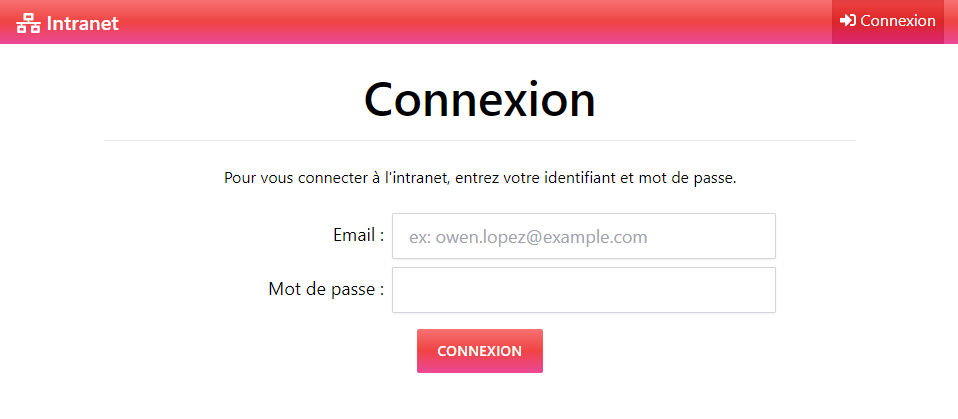
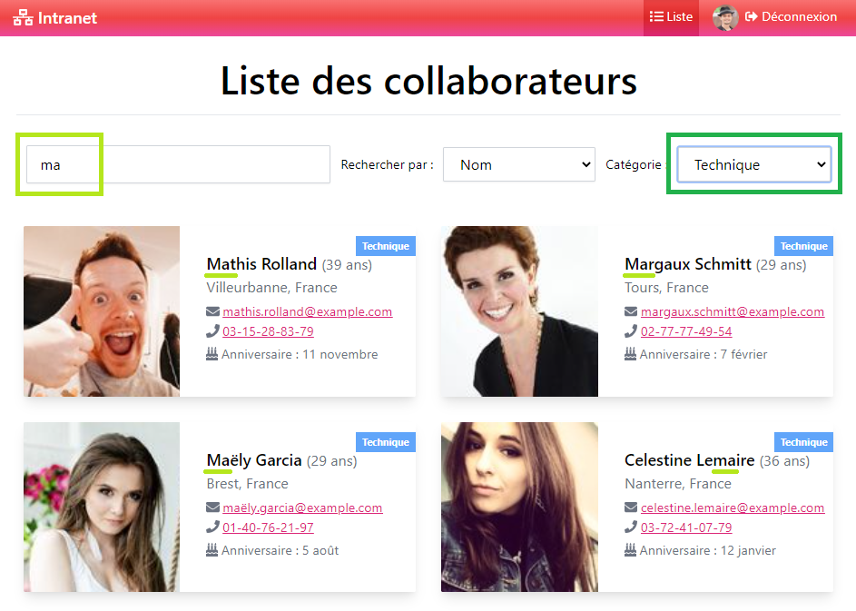
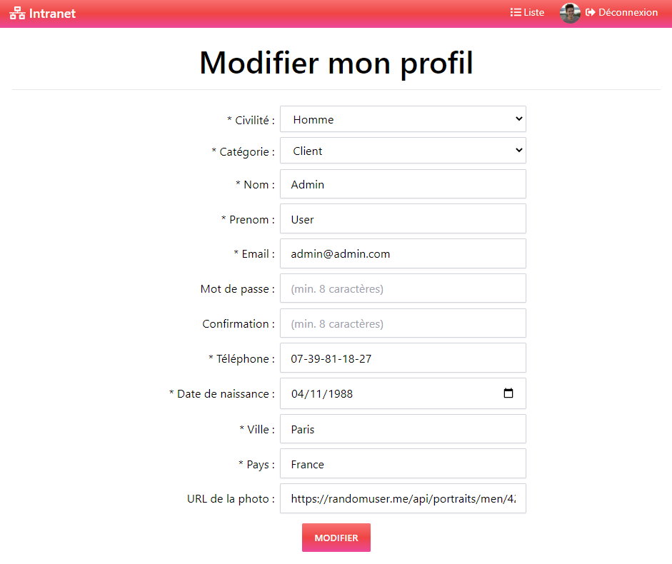
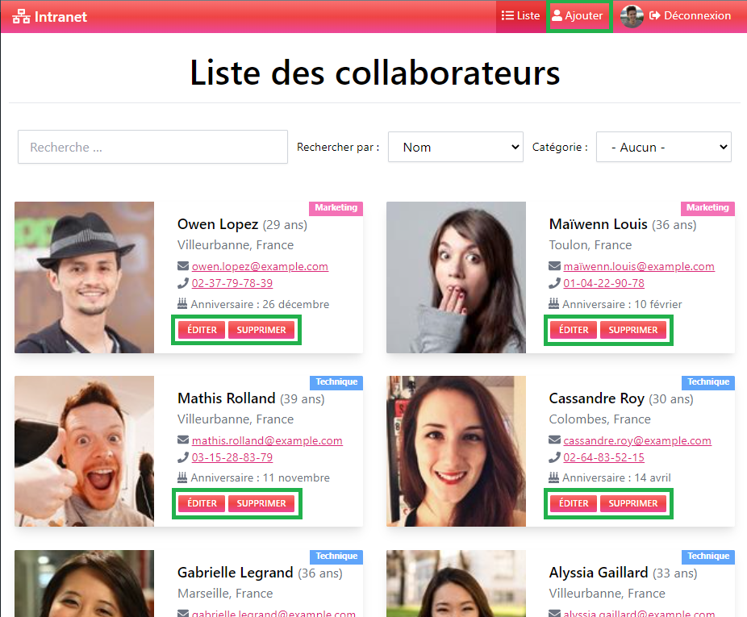
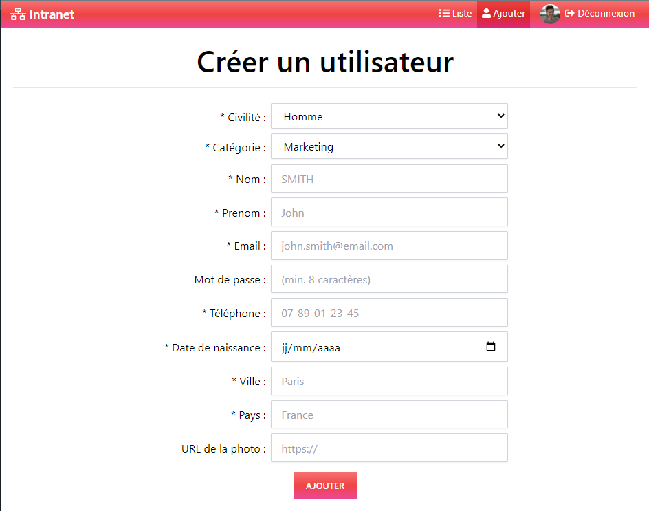

# Intranet - Sujet DFE Projet Final

(Projet individuel)

## Contexte

Vous travaillez dans une société de taille moyenne en pleine expension, et faites partie du pôle Technique.

Suite au récent recrutement de nombreux collaborateurs, la direction souhaite créer une plate-forme accessible en interne pour faciliter et encourager les relations entre collaborateurs.

Votre manager s'est déjà chargé de développer le backend Node.js en API REST.

En tant que développeur Front-End, **vous êtes en charge de développer le Front-End de la plateforme Intranet avec la bibliothèque React.**

## Stack technique

- Back-end (fourni) : Node.js / Express
- Front-end : **HTML, CSS, React**

## Présentation du fonctionnement de la plateforme

### A. Utilisateur standard :

Un collaborateur (= utilisateur) doit pouvoir se connecter au système via son login et mot de passe :



Une fois connecté, l'utilisateur arrive sur la page d'accueil qui lui présente un de ses collaborateurs au hasard :


Le bouton "_Dire bonjour à quelqu'un d'autre_" doit permettre d'afficher un autre collaborateur au hasard.

L'utilisateur peut via le menu se déplacer sur la page de listing des collaborateurs de la société. Les collaborateurs s'affichent sous forme de card, avec toutes leurs caractéristiques :


Cette page doit également permettre un affichage avec un système de filtres par **nom**, **localisation** et **catégorie** :



La liste doit se rafraîchir instantanément.

L'utilisateur doit également pouvoir accéder à une page de modification de ses informations personnelles (incluant le login/mot de passe) en cliquant sur son image de profil dans le header :



Enfin, l'utilisateur doit pouvoir se déconnecter. Après déconnexion, aucune des pages précédentes (home, listing) ne sont accessibles.

### B. Administrateur :

L'administrateur est un utilisateur standard, disposant de privilèges supplémentaires. Il peut :

- Ajouter un nouveau collaborateur
- Modifier un collaborateur existant
- Supprimer un collaborateur existant

Dans sa barre de menu, il a accès à un lien pour **"Ajouter"** un nouveau collaborateur.

L'affichage d'une card d'un utilisateur lui propose aussi 2 boutons supplémentaires **"Éditer"** et **"Supprimer"** :



La page d'ajout est un simple formulaire pour créer un nouveau collaborateur :



**L'administrateur peut également lors de la modification d'un collaborateur lui assigner le rôle d'administrateur.**

-----

## Contraintes techniques

Vous **devez** utiliser la bibliothèque React, avec le bundler [ViteJS](https://vitejs.dev/) (qui est beaucoup plus rapide que `create-react-app`).

Pour démarrer, utilisez la commande suivante :

```bash
npm create vite@latest my-vue-app -- --template react
```

#### Service

Pour communiquer avec l'API, vous utiliserez un fichier de **service JS** à part des components React.

Le choix d'une bibliothèque d'échanges HTTP comme `axios` n'est pas obligatoire, mais fortement conseillée. Renseignez-vous sur [comment configurer une instance Axios](https://axios-http.com/docs/instance) pour votre service JS. L'utilisation [d'intercepteurs Axios](https://axios-http.com/docs/interceptors) devrait également vous être utile pour configurer l'envoi d'un token d'authentification à chaque requête.

Vous aurez aussi certainement besoin de stocker le token de l'utilisateur dans le **Local Storage** de son navigateur. Vous utiliserez également un service pour récupérer/stocker ce token.

#### State management

Vous **devez utiliser un state manager pour gérer l'état local de votre application**. Cet état local permettra (entre autre) de stocker les informations d'un utilisateur connecté.

Dans l'idéal, vous utiliserez **[Redux Toolkit](https://redux.js.org/redux-toolkit/overview)** (*l'utilisation de React-Redux à l'ancienne est toléré, mais sachez que la nouvelle norme est de privilégier Redux Toolkit*)

#### Style

Le style visuel de l'application est complètement libre.

Vous veillerez à développer une interface web responsive, accessible et aux normes HTML et CSS.

Le choix d'un framework CSS (Bootstrap / Tailwind) est totalement libre, mais vous devrez dans ce cas les personnaliser (pas de styles par défaut !).

#### Arborescence de travail

Vous organiserez vos dossiers selon l'architecture suivante :

```bash
.
└── src/
    ├── views       # les composants de page
    ├── components  # les composants d'affichage (card, forms, …)
    ├── services    # les services JS (axios, localStorage)
    └── features    # les features Redux Toolkit
```

## Récupérer le serveur

Le serveur contenant l'API vous est déjà fourni.

Commencez par créer un nouveau répertoire pour votre projet :

```bash
mkdir -p intranet/
```

```bash
mkdir -p exam-intranet
cd exam-intranet
git clone git@github.com/jm-courses/exam-intranet.git --depth 1 --branch "Branch name" "Git Repo" "Folder name"
cd ../

# https://digitaldrummerj.me/git-clone-branch/
```

...

Ouvrez un terminal à l'emplacement du répertoire et installez d'abord les dépendances :

```bash
cd server-json
npm install
```

Puis, lancez l'API :

```bash
npm run api
```

Cela ouvrira la page http://localhost:7000/ dans votre navigateur web, contenant **la documentation de l'API.**

## Détails supplémentaires

La structure d'un collaborateur est la suivante :

```
id          -   Identifiant unique numérique
gender      -   Sexe ("male" ou "female")
firstname   -   Prénom
lastname    -   Nom
email       -   Email pro
password    -   Mot de passe haché avec bcrypt
phone       -   Numéro de la ligne directe
birthdate   -   Date de naissance
city        -   Ville où le collaborateur travaille
country     -   Pays où le collaborateur travaille
photo       -   Une URL valide vers une image en ligne
category    -   Service dans lequel travaille le collaborateur ("Marketing", "Client" ou "Technique")
isAdmin     -   Le collaborateur est un administrateur de la platforme (Boolean)
```

Pour votre information, le set de données fourni propose une liste de 42 utilisateurs. Pour faire vos tests de connexion, sachez que le mot de passe haché de chaque utilisateur correspond à la partie avant le `@` de son adresse email. Par exemple, pour l'utilisateur **Owen Lopez** :
```json
{
    …
    "email": "owen.lopez@example.com",
    "password": "$2b$10$IExQBXEZVifvfEOWvWsmO.4.OocNb7zQzurQerwOQh1tZx/3okSp.",
    …
}
```

Ce hash correspond à la chaîne `owen.lopez`.

Le seul administrateur du set par défaut est `admin@admin.com` avec le mot de passe `admin`.

## Présentation et rendu

Vous présenterez votre projet devant un Jury de professionnel externes à l'École.

Vous préparerez une présentation ([Google Slides](https://docs.google.com/presentation/) ou [Reveal.js](https://revealjs.com/) au choix) présentant au moins les éléments suivants :
- le contexte du projet
- les contraintes techniques
- la stack technique choisie
- quelques exemples de code que vous expliquerez en live
- les problématiques que vous avez rencontrées et comment vous les avez résolues

Vous passerez ensuite à une **démonstration fonctionnelle complète** de votre application.

Le code doit être disponible et consultable publiquement sur un repository Github / Gitlab / Bitbucket au choix.

Vous veillerez évidemment à travailler avec Git et sauvegarderez le travail effectué tout au long de la semaine via des **commits réguliers** et **CORRECTEMENT TITRÉS.**

---

N'oubliez pas que vous pouvez solliciter votre formateur tout au long du suivi pour des besoins/conseils.

Ne restez pas bloqués, posez des questions.

Bon courage 🙂